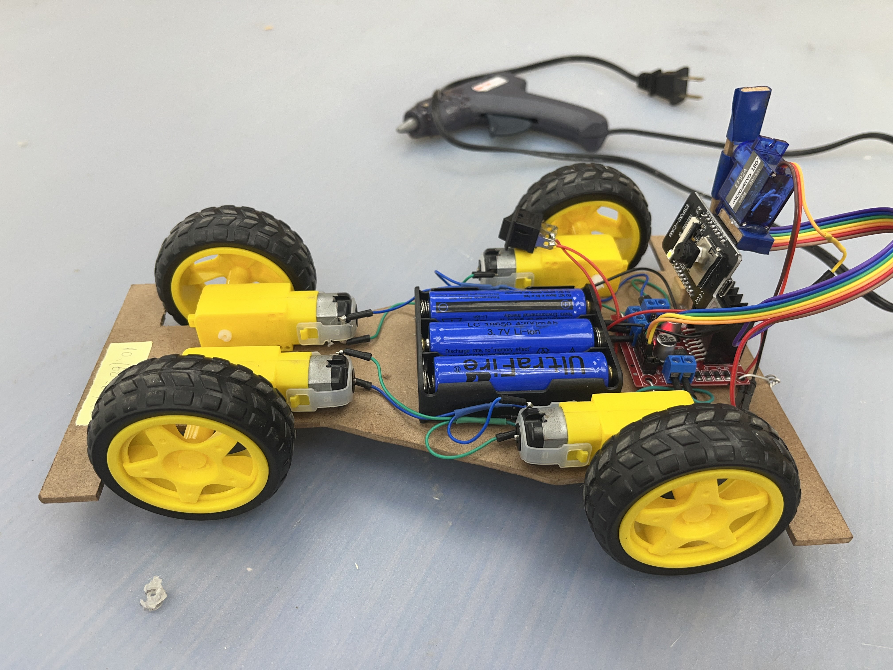

# Esp32 Cam Car

> Program about control Esp32 Cam

小車本人：

 

## 開發環境

- 使用語言：Arduino 1.8.15
- 使用晶片：Esp32Cam

## 檔案介紹

``` bash
├── Main
│   └── Main
├── Test
│   ├── LED_Test
│   ├── Motor_Test
│   ├── Pwm_Test
│   ├── Web_Test
│   ├── Control_Test
│   └── Cam_Test
└── Example
    └── Example
```
Main：開發中的主程式，但因為未知錯誤而暫停開發

Test：測試程式，可以從上到下逐項進行測試來排查硬體及軟體問題

Example：開發商給予的原始碼，可以正常運行

## 目前開發進度

可以透過Html網頁來控制小車，但是影像傳輸不了。似乎是因為傳輸時按鈕佔據了控制頻道，所以導致影像阻塞，目前還未想到解決方法。

## 相關程式

<a href="https://github.com/happpycorn/2024_DragonBoat">
  
</a>
<a href="https://github.com/happpycorn/2023_DragonBoat">
  
</a>
